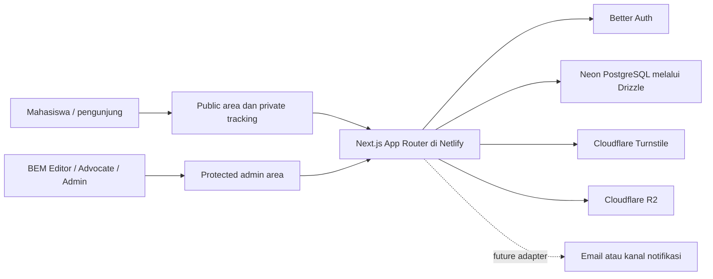
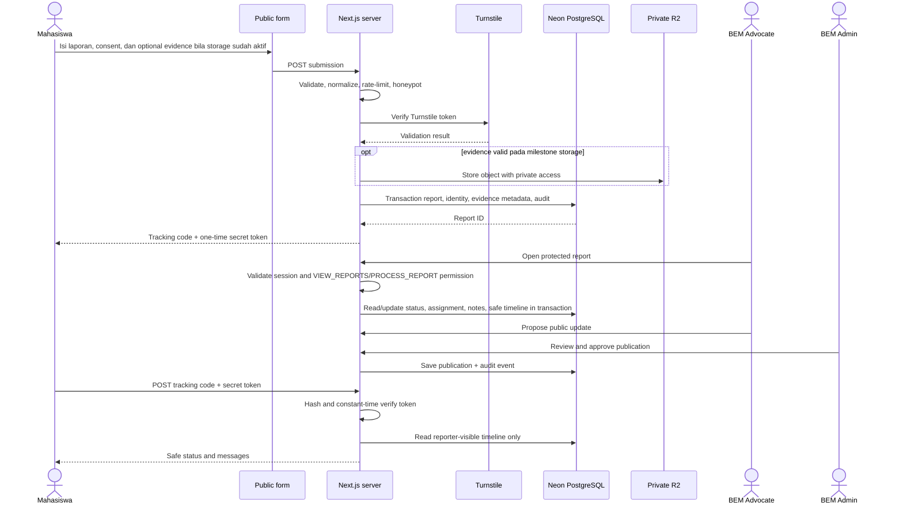

# Architecture — Muara Aspirasi

> Status: M6 case management inti sudah diimplementasikan pada source; publication publik, R2, notifikasi eksternal, dan production masih direncanakan.
> Sumber kebenaran produk: `PRD.md`. Bila dokumen ini bertentangan dengan PRD, PRD yang berlaku.

## 1. Tujuan sistem

Muara Aspirasi adalah portal advokasi dan informasi mahasiswa BEM FTI Universitas Budi Luhur. Sistem harus menyediakan dua loop yang terpisah tetapi saling mendukung:

1. **Mahasiswa ke BEM:** mahasiswa mengirim aspirasi secara terstruktur, memperoleh kode dan token rahasia, lalu melihat progres yang aman untuk pelapor.
2. **BEM ke mahasiswa:** BEM mengelola laporan secara privat dan menerbitkan pembaruan advokasi atau informasi mahasiswa yang sudah ditinjau.

Sistem bukan dinding keluhan publik, bukan layanan darurat, bukan pengganti sistem akademik, dan tidak menyediakan akun mahasiswa pada MVP.

## 2. Gaya arsitektur

**Keputusan:** gunakan modular monolith dalam satu aplikasi Next.js.

Alasannya:

- Lingkup MVP dan ukuran tim belum membenarkan microservices.
- Satu repository memudahkan type safety, transaksi, audit, pengujian, dan deployment.
- Modul domain tetap dipisahkan agar business logic tidak melekat pada komponen UI atau route.
- Integrasi eksternal dibungkus sebagai adapter sehingga Neon, Better Auth, Turnstile, R2, dan layanan notifikasi dapat diuji atau diganti tanpa mengubah domain inti.

Prinsip utama:

- server-first dan least privilege;
- data privat tidak pernah dikirim ke Client Component kecuali field yang sudah dipilih secara eksplisit;
- autentikasi dan otorisasi diverifikasi di setiap operasi sensitif;
- public content dan original report merupakan model serta jalur publikasi yang berbeda;
- perubahan penting menghasilkan audit event;
- integrasi eksternal gagal dengan aman dan tidak membuka data.

## 3. Stack dan alasan

| Bagian               | Teknologi                  | Status                             | Alasan                                                                                                                                        |
| -------------------- | -------------------------- | ---------------------------------- | --------------------------------------------------------------------------------------------------------------------------------------------- |
| Web framework        | Next.js 16 App Router      | Sudah dipasang                     | Mendukung Server Components, Route Handlers, Server Actions, metadata, dan satu deployment full-stack.                                        |
| UI runtime           | React 19                   | Sudah dipasang                     | Runtime UI yang digunakan Next.js saat ini.                                                                                                   |
| Bahasa               | TypeScript strict          | Sudah dipasang                     | Menurunkan risiko kontrak data dan otorisasi yang tidak konsisten.                                                                            |
| Styling              | Tailwind CSS 4             | Sudah dipasang                     | Sistem token/utilitas konsisten dan mobile-first.                                                                                             |
| UI primitives        | shadcn/ui                  | Direncanakan, belum dipasang       | Roadmap meminta hanya komponen yang benar-benar dipakai.                                                                                      |
| Quality              | ESLint, Prettier, Vitest   | Sudah dipasang                     | Quality gate lokal dan CI sudah tersedia.                                                                                                     |
| Hosting              | Netlify                    | Konfigurasi baseline tersedia      | Mendukung Next.js App Router melalui adapter yang dikelola Netlify dan Deploy Preview.                                                        |
| Database             | Neon PostgreSQL            | Foundation M3 selesai              | PostgreSQL terkelola dengan branch `development`/`preview`; production belum ada.                                                             |
| ORM/migration        | Drizzle ORM + Drizzle Kit  | Foundation M3 selesai              | Schema TypeScript eksplisit dan migration SQL yang direview/dicek pada branch non-production.                                                 |
| Admin authentication | Better Auth                | Milestone 4 selesai                | BEM-only login, session, role enforcement, protected shell, access management, auth audit, dan runtime acceptance non-production sudah lulus. |
| Case management      | Next.js + Drizzle          | Milestone 6 selesai pada source    | Queue/filter, detail privat, assignment, state transition, internal note, reporter-safe update, archive/reopen, concurrency guard, dan audit. |
| Anti-spam            | Cloudflare Turnstile       | Milestone 5 selesai non-production | Widget form publik dan Siteverify server-side; development/preview memakai dummy key resmi, production wajib memiliki widget sendiri.         |
| Object storage       | Cloudflare R2              | Direncanakan                       | Bukti privat dan media editorial dapat dipisahkan dari database.                                                                              |
| Notification         | Timeline internal aplikasi | MVP default                        | Email/WhatsApp masih open question dalam PRD dan tidak termasuk default MVP.                                                                  |

## 4. Konteks sistem



Better Auth berjalan sebagai bagian dari aplikasi Next.js, bukan layanan otorisasi terpisah yang menggantikan pemeriksaan izin pada domain. Diagram memisahkannya agar boundary tanggung jawab terlihat.

## 5. Area aplikasi dan boundary akses

| Area                 | Route konseptual                                                    | Siapa yang mengakses                            | Boundary                                                                                                 |
| -------------------- | ------------------------------------------------------------------- | ----------------------------------------------- | -------------------------------------------------------------------------------------------------------- |
| Public content       | `/`, `/update`, `/info-mahasiswa`, `/tentang`, `/kebijakan-privasi` | Semua pengunjung                                | Hanya content berstatus published dan metadata aman. Tidak boleh membaca original report.                |
| Kirim aspirasi       | `/aspirasi/kirim`                                                   | Mahasiswa tanpa login                           | Validasi input, ethics consent, Turnstile, rate limit, dan batas upload dilakukan server-side.           |
| Private tracking     | `/aspirasi/lacak`                                                   | Pemegang tracking code + secret token           | Request menggunakan POST; token tidak masuk URL, analytics, atau log. Hanya timeline reporter-safe.      |
| Admin authentication | `/admin/login`, `/api/auth/*`                                       | Akun BEM yang dibuat admin                      | Public registration dinonaktifkan. Session divalidasi server-side.                                       |
| Admin work area      | `/admin`, `/admin/laporan`, `/admin/laporan/[id]`                   | `EDITOR`, `ADVOCATE`, `ADMIN` sesuai permission | Setiap read/mutation sensitif melakukan role check di server. Redirect/proxy bukan satu-satunya kontrol. |

Tidak ada role `MODERATOR` terpisah pada MVP. Tugas triage dan moderasi laporan berada pada `ADVOCATE`; keputusan sensitif dan pengelolaan akun berada pada `ADMIN`.

## 6. Struktur folder target

Struktur berikut memuat area yang sudah tersedia dan area future yang masih direncanakan.

```text
src/
├── app/
│   ├── (public)/                 # halaman publik
│   ├── aspirasi/                 # kirim dan lacak tanpa login mahasiswa
│   ├── admin/                    # area BEM terlindungi
│   └── api/
│       ├── admin/
│       │   └── reports/          # queue/detail case management M6
│       ├── auth/[...all]/        # Better Auth handler
│       ├── aspirasi/             # endpoint publik dengan abuse controls
│       └── webhooks/             # hanya bila integrasi eksternal membutuhkan
├── components/
│   ├── ui/                       # primitive terpakai dari shadcn/ui
│   ├── public/                   # public shell dan content presentation
│   └── admin/                    # komponen admin
├── features/
│   ├── aspirations/              # use case laporan dan tracking
│   ├── advocacy-updates/         # public advocacy publishing
│   ├── student-info/             # informasi mahasiswa
│   └── admin-access/             # permission dan admin workflows
├── server/
│   ├── auth/                     # session dan authorization helpers
│   ├── db/                       # Drizzle client, schema, repositories
│   ├── security/                 # validation, rate limit, token hashing
│   ├── storage/                  # R2 adapter
│   └── notifications/            # no-op/in-app default, provider future
└── lib/                          # config dan utility netral
drizzle/                          # generated, reviewable SQL migrations
docs/                             # requirement dan keputusan proyek
```

Aturan dependency:

- `app` boleh memanggil `features` dan `server` melalui use case yang jelas.
- komponen presentational tidak mengakses database atau environment secret;
- `features` tidak mengetahui detail Netlify, Neon, atau R2;
- hanya modul `server` yang membaca secret atau melakukan I/O privat;
- schema database tidak diimpor ke Client Component.

## 7. Arsitektur frontend

- Gunakan Server Components sebagai default untuk public reads dan admin reads.
- Gunakan Client Components hanya untuk state interaktif seperti navigation menu, multi-step form, filter lokal, dialog, dan optimistic feedback.
- Data dari server ke client harus berupa DTO minimal dan serializable. Entity privat lengkap tidak boleh langsung diteruskan ke Client Component.
- Public archive membaca hanya publication projection, bukan report repository.
- Route-level `loading`, `error`, dan `not-found` dipakai pada halaman yang membutuhkan data.
- Desain visual mengikuti `UX_UI_DESIGN_SYSTEM.md`; lima aset di `docs/assets` tetap referensi sampai izin tertulis dan versi resmi tersedia.

## 8. Backend dan API

### 8.1 Runtime

Gunakan Node.js runtime default. Tidak ada kebutuhan Edge runtime yang sudah disetujui, sementara auth, hashing, database, dan storage membutuhkan kompatibilitas Node yang stabil.

### 8.2 Pemilihan entry point

| Kebutuhan                    | Default                                             | Catatan keamanan                                                                                                |
| ---------------------------- | --------------------------------------------------- | --------------------------------------------------------------------------------------------------------------- |
| Read dari Server Component   | Panggil data access/use case langsung               | Jangan round-trip ke Route Handler internal. Kembalikan DTO minimal.                                            |
| Mutation dari admin UI       | Server Action atau Route Handler terlindungi        | Keduanya diperlakukan sebagai endpoint publik: validasi session, permission, input, dan audit di dalam handler. |
| Submit/lacak aspirasi publik | Route Handler POST                                  | Boundary eksplisit untuk Turnstile, rate limit, generic error, idempotency, dan no-store response.              |
| Better Auth                  | Catch-all Route Handler yang disediakan Better Auth | Public registration dinonaktifkan; origin/session policy dikonfigurasi eksplisit.                               |
| Webhook eksternal            | Route Handler                                       | Verifikasi signature dan idempotency; belum diperlukan pada MVP awal.                                           |

### 8.3 Layer tanggung jawab

1. **Transport:** membaca request dan membentuk response; tidak menyimpan business rule.
2. **Validation:** schema input, normalisasi, batas panjang, serta file metadata.
3. **Authorization:** memastikan actor/session memiliki permission untuk use case.
4. **Use case/domain:** transition status, publication approval, tracking access, dan invariants.
5. **Repository:** query Drizzle terparameterisasi dan transaksi.
6. **Adapter:** Turnstile, R2, notifikasi, hashing/crypto, dan clock/ID generator.
7. **Audit:** mencatat outcome sensitif tanpa menyimpan secret atau isi privat berlebihan.

### 8.4 Implementasi case management Milestone 6

- Server Component `/admin/laporan` dan `/admin/laporan/[id]` memanggil use case langsung; Client Component hanya menerima DTO serializable yang sudah dipilih.
- `src/server/aspirations/case-management.ts` menjadi boundary use case untuk queue, filter status/kategori/urgensi/tanggal/PIC, detail, assignment, internal note, reporter-visible message, status transition, archive, dan reopen.
- `src/app/api/admin/reports/*` tetap memeriksa session serta permission pada setiap request. `VIEW_REPORTS` membuka baca; `PROCESS_REPORT` membuka triage; `ARCHIVE_REPORT` dan `REOPEN_REPORT` hanya dimiliki `ADMIN` pada matrix saat ini.
- Semua mutasi memakai satu transaksi dan optimistic concurrency berbasis `updatedAt`. Jika versi stale, request gagal dengan conflict dan tidak menimpa perubahan actor lain.
- DTO detail memisahkan original report, identity, evidence metadata, internal notes, status events, assignment history, dan audit. `objectKey`, signed URL, tracking secret/hash, serta isi note yang sudah dihapus tidak dikirim ke browser.
- M6 tidak menambah migration karena tabel `aspiration_reports`, `reporter_identities`, `report_evidence`, `report_status_events`, `internal_notes`, `report_assignments`, dan `audit_events` sudah disiapkan pada foundation M3. Binary evidence/R2 read masih menjadi pekerjaan storage milestone berikutnya.

## 9. Database dan persistence

- Neon PostgreSQL menjadi system of record untuk laporan, identity/contact, status events, assignments, internal notes, publications, dan audit events.
- Drizzle schema menjadi kontrak implementasi; perubahan production hanya melalui migration yang dihasilkan, direview, dan diuji pada branch non-production.
- Runtime serverless memakai pooled connection string. Migration memakai direct/unpooled connection yang terpisah.
- Development, preview, dan production tidak berbagi branch/database writable.
- Tracking secret hanya disimpan sebagai hash kuat; token plaintext hanya diperlihatkan satu kali setelah submission.
- Reporter identity dipisahkan secara logis dari report agar permission dan query dapat membatasi akses.
- Data model rinci berada di `DATA_MODEL.md`.

## 10. Authentication dan authorization

- Better Auth hanya untuk akun BEM. Mahasiswa tidak memiliki akun pada MVP.
- Akun dibuat oleh `ADMIN`; signup publik tidak tersedia.
- Better Auth menangani session/auth tables (`auth_sessions`, `auth_accounts`, `auth_verifications`) dan endpoint `/api/auth/*`; relasi user tetap memakai `bem_users`.
- Role aplikasi: `EDITOR`, `ADVOCATE`, dan `ADMIN`.
- Pemeriksaan cookie di `proxy.ts` boleh dipakai untuk redirect optimistis, tetapi bukan kontrol keamanan final.
- Setiap protected page, Server Action, dan Route Handler memvalidasi session serta permission server-side.
- Permission matrix dan baseline session dijelaskan di `SECURITY_PRIVACY.md`.
- `src/server/auth/session.ts` menjadi boundary session server-side; `src/server/auth/roles.ts` menjadi permission matrix eksplisit; `src/server/auth/audit.ts` mencatat event auth tanpa credential.

## 11. Penyimpanan aset

### Evidence privat

- Bucket/prefix tidak public.
- Upload memakai izin singkat dan spesifik terhadap object key acak.
- Metadata di database menghubungkan object ke satu report.
- Download hanya diberikan setelah session dan permission diverifikasi, melalui proxy aplikasi atau short-lived signed GET.
- Validasi tipe, ukuran, count, extension, magic bytes, checksum, dan status pemeriksaan file dilakukan sebelum bukti dianggap tersedia.

### Media editorial publik

- Dipisahkan dari evidence privat, idealnya melalui bucket atau credential berbeda.
- Hanya media yang sudah disetujui dan memiliki alt text serta sumber/credit yang boleh dipublikasikan.
- Lima file `docs/assets` tidak termasuk media production sampai ada izin tertulis.

## 12. Notifikasi

Default MVP adalah **in-app tracking timeline** dan feedback UI. Tidak ada email, WhatsApp, atau push notification yang diasumsikan.

Jika kanal eksternal disetujui kemudian, domain memanggil notification interface; provider menerima payload minimum dan tidak menerima chronology/evidence kecuali benar-benar diperlukan serta disetujui.

## 13. Alur data laporan



## 14. Environment boundary

| Environment | Application                    | Database                           | Storage               | Credentials                                     |
| ----------- | ------------------------------ | ---------------------------------- | --------------------- | ----------------------------------------------- |
| Development | Local Next.js                  | Dedicated development branch       | Dev bucket/prefix     | Local `.env.local`, never committed             |
| Preview     | Netlify Deploy Preview         | Per-PR or dedicated preview branch | Preview bucket/prefix | Netlify preview context                         |
| Production  | Netlify production from `main` | Protected production branch        | Production buckets    | Netlify production context with least privilege |

Detail operasional berada di `DEPLOYMENT_RUNBOOK.md`.

## 15. Open Question dan Proposed Default

| Open Question                                        | Proposed Default                                                                                                                                                | Mengapa belum final                                               |
| ---------------------------------------------------- | --------------------------------------------------------------------------------------------------------------------------------------------------------------- | ----------------------------------------------------------------- |
| Domain resmi dan owner akun vendor?                  | Gunakan akun organisasi BEM/FTI, bukan akun personal; domain ditentukan owner sebelum production.                                                               | PRD menandainya sebagai keputusan terbuka.                        |
| Apakah identity boleh dibagikan ke unit tujuan?      | Default `CONFIDENTIAL_BEM_ONLY`; berbagi field minimum hanya dengan consent eksplisit per laporan.                                                              | Membutuhkan kebijakan BEM dan privacy notice resmi.               |
| Retention report, contact, evidence, dan audit?      | Report/contact/evidence 180 hari setelah closure; audit metadata 365 hari; subject to owner/legal review.                                                       | Durasi resmi dan kanal deletion belum diputuskan.                 |
| Apakah admin wajib MFA?                              | MFA wajib untuk `ADMIN` sebelum production; recovery harus dimiliki minimal dua owner organisasi.                                                               | Metode MFA/perangkat yang dipilih diuji saat kesiapan production. |
| Apakah evidence memerlukan malware scanning service? | Evidence tetap private dan unavailable sampai validation selesai; integrasi malware scanner menjadi launch gate bila jenis file melampaui image/PDF terkontrol. | Provider, biaya, dan SLA belum dipilih.                           |
| Kanal notifikasi eksternal?                          | Tidak ada pada MVP; gunakan tracking timeline.                                                                                                                  | PRD menempatkan email sebagai keputusan masa depan.               |
| Rate-limit store?                                    | Bucket Neon `public_rate_limit_buckets` dengan unique key atomik dan HMAC signal; hindari in-memory.                                                            | Kapasitas/latensi Neon harus dipantau sebelum production.         |
| Rich text editor atau Markdown?                      | Mulai dari structured/plain text; jangan render raw HTML.                                                                                                       | Workflow editorial dan kebutuhan formatting belum diuji.          |

## 16. Referensi teknis

- [Next.js data security](https://nextjs.org/docs/app/guides/data-security)
- [Next.js authentication guidance](https://nextjs.org/docs/app/guides/authentication)
- [Better Auth Next.js integration](https://better-auth.com/docs/integrations/next)
- [Neon branching workflow](https://neon.com/docs/get-started-with-neon/workflow-primer)
- [Netlify Next.js overview](https://docs.netlify.com/build/frameworks/framework-setup-guides/nextjs/overview/)
- [Cloudflare Turnstile server-side validation](https://developers.cloudflare.com/turnstile/get-started/server-side-validation/)
- [Cloudflare R2 presigned URLs](https://developers.cloudflare.com/r2/api/s3/presigned-urls/)
