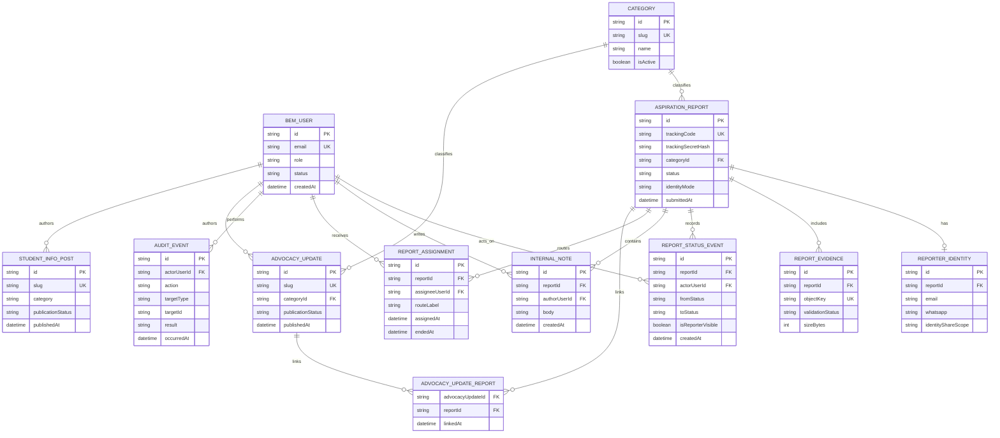
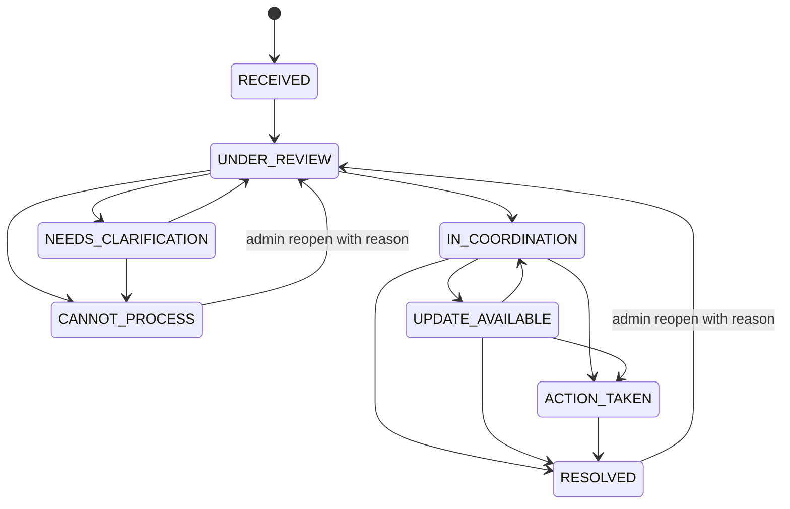

# Data Model — Muara Aspirasi

> Status: model domain diimplementasikan sebagai foundation Drizzle pada Milestone 3; persistence auth Better Auth ditambahkan pada Milestone 4; tambahan persistence submission/rate-limit Milestone 5 telah diterapkan melalui migration additive pada Neon development dan preview. Neon main/production tidak disentuh.
> Terminologi utama mengikuti `PRD.md`.

Implementasi referensi: `src/server/db/schema/`, migration `drizzle/20260829191548_milestone_3_foundation/`, dan migration auth `drizzle/20260830054722_wise_dexter_bennett/`. Dokumen ini tetap menjadi kontrak produk/data; service mutation, report authorization runtime, R2, dan public projection belum diimplementasikan.

## 1. Tujuan model

Model data harus memungkinkan BEM menerima dan menangani aspirasi secara privat, memberi progres aman kepada pelapor, serta menerbitkan update publik yang tidak membocorkan original report atau identity.

Prinsip:

- pisahkan data privat, internal, reporter-visible, dan public;
- simpan tracking secret hanya sebagai hash;
- simpan setiap transition dan tindakan sensitif sebagai event/audit;
- gunakan identifier opaque, bukan NIM/email sebagai primary key;
- simpan timestamp UTC dan tampilkan sesuai timezone Asia/Jakarta;
- gunakan archive/retention workflow; hard delete hanya melalui prosedur terotorisasi.

## 2. Klasifikasi data

| Kelas               | Contoh                                                             | Akses                                                                       |
| ------------------- | ------------------------------------------------------------------ | --------------------------------------------------------------------------- |
| Public              | published advocacy update, published student info, category label  | Semua pengunjung                                                            |
| Reporter-visible    | status aman, tanggal update, pesan progres aman                    | Pemegang tracking code + secret token; BEM berwenang                        |
| Internal            | urgency, route, internal summary, assignment, internal note        | `ADVOCATE` dan `ADMIN` sesuai kebutuhan                                     |
| Restricted identity | nama, NIM, email, WhatsApp, consent identity                       | `ADVOCATE`/`ADMIN` dengan need-to-know; tidak pernah public                 |
| Restricted evidence | object, metadata bukti, hasil scan                                 | `ADVOCATE`/`ADMIN` dengan need-to-know; tidak pernah public langsung        |
| Security secret     | tracking token plaintext, session token, password, provider secret | Plaintext tidak disimpan di domain database/log; dikelola auth/secret store |

## 3. Entitas inti

### 3.1 `BemUser`

Akun staf BEM yang dikelola admin.

Field penting:

- `id`: opaque UUID/ULID;
- `name`;
- `email`: normalized, unique;
- `role`: `EDITOR | ADVOCATE | ADMIN`;
- `status`: `ACTIVE | SUSPENDED`;
- `createdAt`, `updatedAt`, `lastLoginAt`;
- `createdByUserId`: nullable untuk bootstrap admin pertama.

Credential, session, verification token, dan account provider dikelola tabel Better Auth. Password plaintext tidak pernah menjadi field domain.

### 3.1.1 Persistence Better Auth

Fondasi M4 memetakan Better Auth ke PostgreSQL melalui Drizzle adapter:

- `auth_sessions`: session aktif, expiry, user agent, dan IP signal terbatas;
- `auth_accounts`: credential account dengan provider `credential`, password yang sudah di-hash Better Auth, serta account identifier;
- `auth_verifications`: verification record yang diperlukan adapter, tanpa memasukkan secret ke seed atau log aplikasi.

Ketiga tabel memiliki foreign key ke `bem_users` dengan cascade pada penghapusan user auth. Signup publik tetap nonaktif dan user domain yang dapat membuat session harus berstatus `ACTIVE`.

### 3.2 `Category`

Lookup kategori laporan sesuai PRD.

Field penting:

- `id`, `slug`, `name`;
- `description`;
- `defaultRouteLabel`: teks internal, bukan relasi eksternal pada MVP;
- `isActive`, `sortOrder`;
- `createdAt`, `updatedAt`.

Seed awal: facilities, computer laboratory, classroom/learning comfort, academic process, library/resources, student wellbeing, serta suggestion/idea.

### 3.3 `AspirationReport`

Record inti aspirasi privat.

Field penting:

- `id`;
- `trackingCode`: opaque, unique, aman untuk diketik tetapi bukan secret;
- `trackingSecretHash`: hasil hash `scrypt` dengan salt acak dari token 256-bit; token plaintext tidak disimpan;
- `submissionKeyHash`: HMAC dari idempotency key; nullable hanya agar migration kompatibel dengan record pre-M5, selalu diisi untuk submission baru;
- `categoryId`;
- `title`, `location`, `chronology`, `impact`;
- `suggestedSolution`: nullable;
- `identityMode`: enum `CONFIDENTIAL_BEM_ONLY | CONSENTED_LIMITED_SHARE`; default `CONFIDENTIAL_BEM_ONLY`;
- `ethicsAcceptedAt` dan `privacyNoticeVersion`;
- `status`: lifecycle dari PRD;
- `urgency`: proposed enum `LOW | NORMAL | HIGH | ESCALATE`;
- `internalSummary`: nullable, internal only;
- `submittedAt`, `updatedAt`, `resolvedAt`, `archivedAt`;
- `duplicateOfReportId`: nullable, hanya untuk internal deduplication.

`trackingCode` tidak cukup untuk membuka report. Akses tracking selalu membutuhkan token yang cocok dengan `trackingSecretHash`.

### 3.4 `ReporterIdentity`

Tepat satu record per report untuk memisahkan PII dari chronology dan memenuhi verifikasi BEM.

Field penting:

- `id`, `reportId` unique;
- `name`, `nim`: required;
- `email`, `whatsapp`: nullable;
- `contactAllowed`: boolean;
- `identityShareScope`: proposed enum `BEM_ONLY | LIMITED_DESTINATION_UNIT`;
- `consentRecordedAt`, `consentVersion`;
- `createdAt`, `updatedAt`, `deletedAt`.

Identity record selalu dibuat bersama report. Field ini tidak pernah masuk public projection atau analytics.

### 3.5 `ReportEvidence`

Metadata file; binary disimpan di private R2.

Field penting:

- `id`, `reportId`;
- `objectKey`: random dan tidak berasal dari original filename;
- `originalFilename`: sanitized dan restricted;
- `mimeType`, `sizeBytes`, `checksumSha256`;
- `validationStatus`: `PENDING | ACCEPTED | REJECTED | QUARANTINED`;
- `createdAt`, `validatedAt`, `deletedAt`.

Maksimum tiga file mengikuti PRD. Batas byte dan allowlist MIME merupakan Open Question sebelum implementasi.

### 3.6 `ReportStatusEvent`

Append-oriented timeline untuk setiap transition atau reporter-safe update.

Field penting:

- `id`, `reportId`;
- `fromStatus`, `toStatus`: salah satunya dapat null untuk initial event;
- `reporterMessage`: nullable dan sudah disanitasi;
- `isReporterVisible`;
- `reasonCode`: internal normalized reason;
- `actorUserId`: nullable untuk system/submission event;
- `createdAt`.

Status current di `AspirationReport` mempercepat query; event menjadi riwayat perubahan. Keduanya harus diubah dalam satu transaksi.

### 3.7 `InternalNote`

Catatan BEM yang tidak pernah reporter-visible.

Field penting:

- `id`, `reportId`, `authorUserId`;
- `body`;
- `createdAt`, `updatedAt`, `deletedAt`;
- `deletionReason`: nullable dan tetap diaudit.

### 3.8 `ReportAssignment`

Riwayat PIC dan route internal.

Field penting:

- `id`, `reportId`;
- `assigneeUserId`: nullable bila route masih berupa unit;
- `routeLabel`;
- `assignedByUserId`;
- `assignedAt`, `endedAt`;
- `reason`: internal.

Maksimal satu assignment aktif per report adalah invariant yang harus ditegakkan.

### 3.9 `AuditEvent`

Jejak keamanan/administratif append-only secara logis.

Field penting:

- `id`, `occurredAt`;
- `actorUserId`: nullable untuk system/public actor;
- `actorType`: `SYSTEM | PUBLIC | BEM_USER`;
- `action`: nama event terkontrol;
- `targetType`, `targetId`;
- `result`: `SUCCESS | DENIED | FAILED`;
- `reasonCode`;
- `metadata`: JSON yang sudah di-allowlist dan tidak memuat PII, token, credential, chronology, atau evidence URL;
- `requestCorrelationId`;
- `ipSignal`: optional pseudonymous/short-lived signal, bukan raw IP permanen secara default.

### 3.10 `AdvocacyUpdate`

Konten publik independen yang dapat berkaitan dengan beberapa report tanpa menyalin data privat.

Field penting:

- `id`, `slug` unique;
- `title`, `summary`, `body`;
- `categoryId`;
- `progressLabel`;
- `publicationStatus`: `DRAFT | IN_REVIEW | PUBLISHED | ARCHIVED`;
- `coverMediaKey`, `coverAlt`, `sourceCredit`: nullable;
- `authorUserId`, `reviewerUserId`, `publishedByUserId`;
- `createdAt`, `updatedAt`, `publishedAt`, `archivedAt`.

### 3.11 `AdvocacyUpdateReport`

Join internal many-to-many antara report dan public update.

Field penting:

- `advocacyUpdateId`, `reportId` composite unique;
- `linkedByUserId`, `linkedAt`.

Relasi ini tidak diekspos pada public response.

### 3.12 `StudentInfoPost`

Konten informasi mahasiswa.

Field penting:

- `id`, `slug` unique;
- `title`, `summary`, `body`;
- `category`: `ACADEMIC | FACILITIES | OPPORTUNITY | EVENT | SERVICE | ANNOUNCEMENT`;
- `publicationStatus`: `DRAFT | IN_REVIEW | SCHEDULED | PUBLISHED | ARCHIVED`;
- `isPinned`;
- `coverMediaKey`, `coverAlt`, `sourceUrl`, `sourceCredit`: nullable;
- `authorUserId`, `reviewerUserId`, `publishedByUserId`;
- `scheduledAt`, `publishedAt`, `archivedAt`, `createdAt`, `updatedAt`.

### 3.13 `PublicRateLimitBucket`

Bucket throttling publik yang dipakai lintas instance aplikasi tanpa menyimpan raw IP atau tracking code.

Field penting:

- `scope`: endpoint/rule seperti submission IP, tracking IP, tracking code, atau circuit breaker global;
- `signalHash`: HMAC SHA-256 dari signal mentah memakai `PUBLIC_ABUSE_SIGNAL_SECRET` terpisah;
- `windowStartedAt`, `expiresAt`, `attemptCount`;
- `createdAt`, `updatedAt`.

Unique key `scope + signalHash + windowStartedAt` membuat increment bucket atomik di PostgreSQL. Baris kadaluarsa dibersihkan saat endpoint dipakai; nilai mentah tidak pernah disimpan di report atau audit.

## 4. ERD konseptual

Tabel session/account/verification Better Auth tidak dirinci di ERD karena struktur final harus mengikuti versi library yang dipasang pada Milestone Auth. Relasinya tetap: satu `BemUser` memiliki zero-or-many session/account records.

## 5. Lifecycle aspirasi

Status resmi mengikuti PRD:

- `RECEIVED`
- `UNDER_REVIEW`
- `NEEDS_CLARIFICATION`
- `IN_COORDINATION`
- `UPDATE_AVAILABLE`
- `ACTION_TAKEN`
- `RESOLVED`
- `CANNOT_PROCESS`

Transition tambahan dari `NEEDS_CLARIFICATION` dan `UPDATE_AVAILABLE` di atas merupakan **Proposed Default** untuk menyelesaikan loop operasional yang belum lengkap di PRD. Harus dikonfirmasi BEM sebelum schema diimplementasikan.

Setiap transition wajib:

1. memvalidasi current state dan permission;
2. memperbarui `AspirationReport.status`;
3. membuat `ReportStatusEvent`;
4. membuat `AuditEvent` untuk aksi sensitif;
5. menggunakan satu transaksi database;
6. menyertakan alasan saat `CANNOT_PROCESS`, reopen, archive, atau perubahan sensitif.

## 6. Lifecycle publikasi

### Advocacy update

`DRAFT → IN_REVIEW → PUBLISHED → ARCHIVED`

- `EDITOR` dapat membuat/edit draft.
- `ADVOCATE` dapat menyiapkan summary advokasi berdasarkan fakta terverifikasi.
- `ADMIN` menjadi approver default untuk publish/archive sampai matriks approval final disetujui.
- Edit pada published content menghasilkan audit event; full revision history merupakan Open Question.

### Student info

`DRAFT → IN_REVIEW → SCHEDULED | PUBLISHED → ARCHIVED`

- Scheduled publish membutuhkan worker/cron yang belum dikonfigurasi.
- Jika scheduler belum tersedia pada release awal, UI tidak boleh menawarkan schedule palsu; gunakan direct publish setelah approval.

## 7. Constraint dan index konseptual

- unique: `trackingCode`, normalized `BemUser.email`, publication `slug`, dan R2 `objectKey`;
- foreign keys menggunakan restrictive delete untuk report/audit; tidak cascade menghapus bukti sejarah tanpa retention job eksplisit;
- partial unique: satu `ReportAssignment` aktif per report;
- index: report `(status, submittedAt)`, `(categoryId, status)`, assignment `(assigneeUserId, endedAt)`, publication `(publicationStatus, publishedAt)`, audit `(targetType, targetId, occurredAt)`;
- semua text memiliki batas panjang server-side dan database constraint;
- `metadata` JSON pada audit memakai allowlist key, bukan dump request/body;
- public query selalu memfilter `PUBLISHED` dan tidak join ke identity/evidence/internal note.

## 8. Data privat dan data publik

### Tidak boleh tampil publik

- original title/chronology/location/impact report kecuali ditulis ulang sebagai publication independen;
- nama, NIM, email, WhatsApp, consent detail;
- tracking secret/hash;
- evidence object key atau signed URL;
- internal summary, note, route, PIC, urgency/risk flag;
- relationship antara public update dan internal report;
- audit metadata internal.

### Boleh tampil publik setelah approval

- title, summary, body, category, progress label, tanggal, cover media, alt text, source/credit dari `AdvocacyUpdate` berstatus `PUBLISHED`;
- content field dari `StudentInfoPost` berstatus `PUBLISHED`;
- informasi program dan kebijakan yang sudah disetujui.

### Boleh tampil pada private tracking

- tracking code yang dimasukkan pengguna;
- current status dan reporter-visible status events;
- tanggal update;
- reporter message yang ditulis khusus untuk pelapor;
- identity yang pernah dimasukkan hanya jika ada kebutuhan UX yang disetujui; default tidak echo kembali PII.

## 9. Audit trail minimum

Catat event berikut:

- admin login success/failure dan session revocation tanpa menyimpan credential;
- account create, role change, suspend/reactivate;
- report create, view identity/evidence, status transition, assignment change;
- internal note create/update/delete;
- tracking access failure secara agregat/pseudonymous untuk abuse detection;
- publication submit-for-review, approve, publish, edit published, archive, reopen;
- evidence upload validation, authorized download, quarantine, delete;
- policy/retention operation dan deletion request.

Audit log tidak boleh menjadi salinan report atau log request mentah.

## 10. Open Question dan Proposed Default

| Open Question                         | Proposed Default                                                                                                                                         |
| ------------------------------------- | -------------------------------------------------------------------------------------------------------------------------------------------------------- |
| Format ID?                            | UUID/ULID opaque yang dihasilkan server; jangan gunakan sequential ID pada URL publik.                                                                   |
| Hash tracking token?                  | Token acak 256-bit; simpan `scrypt` dengan salt acak dan verifikasi constant-time. Plaintext hanya berada pada response receipt satu kali.               |
| Retention?                            | Report/contact/evidence 180 hari setelah closure dan audit metadata 365 hari, subject to owner/legal review.                                             |
| Encryption field-level PII?           | Pisahkan tabel dan batasi permission lebih dulu; evaluasi app-layer encryption sebelum production berdasarkan threat model dan key-management readiness. |
| Full content revision history?        | Simpan audit event dan snapshot publication saat publish; detail diff menjadi keputusan editorial/security.                                              |
| Urgency enum dan escalation workflow? | `LOW/NORMAL/HIGH/ESCALATE`, tetapi serious-risk handling harus mengikuti SOP kampus yang belum diberikan.                                                |
| File allowlist dan size?              | Mulai sempit: image dan PDF terkontrol, total maksimum tiga file; angka byte final menunggu keputusan operasional.                                       |
| Category dikelola admin?              | Seed dan read-only pada MVP awal; pengubahan category memerlukan milestone policy setelah kebutuhan nyata terlihat.                                      |

## 10.1 Keputusan foundation Milestone 3

Keputusan berikut berlaku untuk database development dan preview Muara Aspirasi. Ini mengunci kontrak implementasi Milestone 3 tanpa menganggap privacy notice, SOP hukum, atau batas production sudah final.

| Area          | Keputusan foundation                                                                                                                                                                                                                               |
| ------------- | -------------------------------------------------------------------------------------------------------------------------------------------------------------------------------------------------------------------------------------------------- |
| Identity mode | `CONFIDENTIAL_BEM_ONLY` menjadi default. `CONSENTED_LIMITED_SHARE` hanya dengan consent eksplisit untuk unit tujuan tertentu; identity tidak pernah masuk projection publik.                                                                       |
| Status        | Status awal `RECEIVED`; lifecycle resmi PRD dipakai apa adanya. Loop `NEEDS_CLARIFICATION` dan `UPDATE_AVAILABLE` pada state diagram diterima sebagai default operasional; reopen/archive/CANNOT_PROCESS wajib beralasan.                          |
| Urgency       | Enum `LOW \| NORMAL \| HIGH \| ESCALATE`, default `NORMAL`. `ESCALATE` hanya flag internal sampai SOP serious-risk disetujui.                                                                                                                      |
| Retention     | Report, contact, dan evidence dihapus/diarsipkan sesuai prosedur 180 hari setelah closure; audit metadata 365 hari; abuse signal maksimal 30 hari dan diminimalkan.                                                                                |
| Evidence      | Maksimal 3 file; JPEG, PNG, dan PDF; maksimal 5 MiB per file dan 10 MiB total. Validasi extension, MIME, magic bytes, checksum, dan random object key; object tetap private/quarantine di R2.                                                      |
| Permission    | Public hanya submit/track dengan code + token dan membaca projection publik. `EDITOR` hanya sanitized summary/konten. `ADVOCATE` menangani report/identity/evidence sesuai need-to-know. `ADMIN` memiliki approval, policy, role, dan audit penuh. |

## 10.2 Keputusan foundation Milestone 4

Keputusan implementasi berikut berlaku untuk fondasi auth lokal dan menjadi acceptance gate sebelum account linking production:

| Area           | Keputusan foundation                                                                                                                                               |
| -------------- | ------------------------------------------------------------------------------------------------------------------------------------------------------------------ |
| Provider       | Better Auth dengan Drizzle adapter PostgreSQL; akun BEM memakai provider `credential`.                                                                             |
| Registration   | Public signup nonaktif. Akun pertama dibuat melalui `npm run auth:bootstrap` pada development/preview saja.                                                        |
| Password       | Panjang 12–128 karakter; plaintext tidak disimpan atau dicetak.                                                                                                    |
| Session        | Cookie auth server-side; protected page/handler wajib memeriksa session dan status `ACTIVE` di server.                                                             |
| Role           | `EDITOR`, `ADVOCATE`, `ADMIN`; permission matrix berada di `src/server/auth/roles.ts`.                                                                             |
| Redirect       | `src/proxy.ts` hanya redirect optimistis; redirect aman menolak target external/non-admin.                                                                         |
| Audit          | Login failure, logout, dan session revoke dicatat sebagai `AuditEvent` dengan metadata allowlist tanpa credential/token.                                           |
| Runtime status | Migration auth sudah diterapkan pada Neon development/preview; bootstrap, login, revoke session, suspend/role, audit, dan logout tervalidasi dengan data sintetis. |

## 11. Referensi implementasi masa depan

- [Drizzle PostgreSQL migrations](https://orm.drizzle.team/docs/get-started/postgresql-existing)
- [Neon database branching workflow](https://neon.com/docs/get-started-with-neon/workflow-primer)
- [OWASP logging guidance](https://cheatsheetseries.owasp.org/cheatsheets/Logging_Cheat_Sheet.html)
